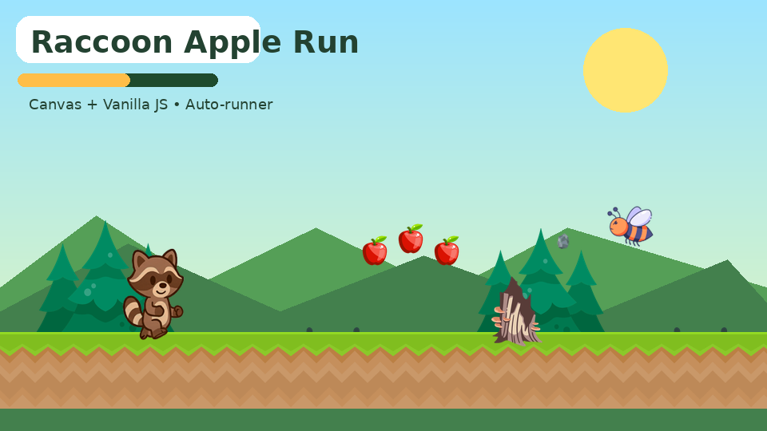

# Raccoon Apple Run — бесконечный платформер на JavaScript

**Raccoon Apple Run** — веб-игра в жанре бесконечного auto-runner платформера. Енот сам бежит по лесной тропе, собирает яблоки, перепрыгивает пни и ямы, пригибается от опасностей и бросает камни в пчёл. Чем дольше длится забег, тем выше скорость и сложнее реакция.



## Идея игры

Енот отправился в лес за яблоками, но по пути потревожил пчёл. Теперь ему нужно быстро бежать вперёд, собирать яблоки, избегать пней и не дать пчёлам остановить забег.

## Функционал

- Бесконечный auto-runner режим: персонаж автоматически бежит вперёд, а мир прокручивается навстречу ему.
- Управление персонажем: небольшое смещение влево/вправо по тропе, прыжок, пригибание, бросок камня.
- Анимация енота через PNG-кадры: бег, прыжок, падение, смерть, победный экран.
- Игровая физика: гравитация, вертикальная скорость, coyote time и jump buffer для более приятного прыжка.
- Коллизии с платформами, пнями, пчёлами, яблоками и снарядами.
- Платформы и земля собираются из тайлового PNG-кусочка земли.
- Бесконечная генерация платформ, ям, пней, пчёл, яблок и дополнительных верхних платформ.
- Декорации фона генерируются случайно: дерево или куст появляются на расстоянии от 300 до 1000 пикселей друг от друга.
- Постепенное увеличение скорости забега.
- Система очков: дистанция + яблоки + сбитые пчёлы.
- Здоровье персонажа: 3 попытки до завершения забега.
- Рекорд сохраняется в `localStorage` браузера.
- Экран старта, экран паузы и экран поражения.
- Пауза и продолжение по `Esc` / `P`.
- Кнопки: старт, продолжить, пауза, рестарт.
- Звуковые эффекты через Web Audio API без внешних аудиофайлов.
- Визуальные эффекты: параллакс-фон, частицы пыли, вспышки при сборе яблок и попадании камнем в пчелу.

## Управление

| Клавиши | Действие |
|---|---|
| `A` / `D` или `←` / `→` | Небольшое смещение по тропе |
| `W` / `↑` | Прыжок |
| `S` / `↓` | Пригнуться |
| `Space` | Бросить камень в пчелу |
| `Esc` / `P` | Пауза / продолжить |
| `R` | Быстрый рестарт |
| `Enter` | Старт после меню или проигрыша |

Так как выбран режим **auto-runner**, движение персонажа вперёд происходит автоматически. Игрок может слегка смещать енота по тропе влево/вправо, но основная задача — вовремя прыгать, пригибаться, собирать яблоки и сбивать пчёл камнями.

## Технологии

- HTML5 Canvas API
- CSS3
- Vanilla JavaScript / ES Modules
- Web Audio API
- `requestAnimationFrame` для игрового цикла
- `localStorage` для сохранения рекорда

Игровые движки и библиотеки не используются. Основная логика игры реализована на чистом JavaScript.

## Структура проекта

```text
index.html
css/
└── style.css
js/
├── main.js
├── Game.js
├── AssetLoader.js
├── Player.js
├── Platform.js
├── Obstacle.js
├── Collectible.js
├── Projectile.js
├── Particle.js
├── Collision.js
├── InputHandler.js
├── Renderer.js
└── AudioManager.js
assets/
├── raccoon/
│   ├── raccoon_walk0.png
│   ├── raccoon_walk1.png
│   ├── raccoon_walk2.png
│   ├── raccoon_jump.png
│   ├── raccoon_fall.png
│   ├── raccoon_dead.png
│   └── raccoon_winner.png
├── decor/
│   ├── grass1.png
│   ├── tree1.png
│   └── bush1.png
└── events/
    ├── apple.png
    ├── bee.png
    ├── stone.png
    └── stump.png
screenshots/
└── gameplay-preview.png
```

## Использование нейросети

- Использованная нейросеть: **ChatGPT**.
- Время выполнения: примерно **20 минут** с учётом интеграции PNG-ассетов, настройки генерации мира, физики, интерфейса и тестирования.
- Нейросеть использовалась как помощник для отдельных частей проекта:
  - черновой схемы игрового цикла на `requestAnimationFrame`;
  - проектирования AABB-коллизий для персонажа, платформ, препятствий, яблок и камней;
  - настройки логики auto-runner режима и постепенного увеличения скорости;

Финальная сборка проекта, интеграция предоставленных PNG-изображений, настройка размеров спрайтов, баланс скорости и оформление игрового интерфейса были выполнены в рамках итоговой доработки проекта.

```
